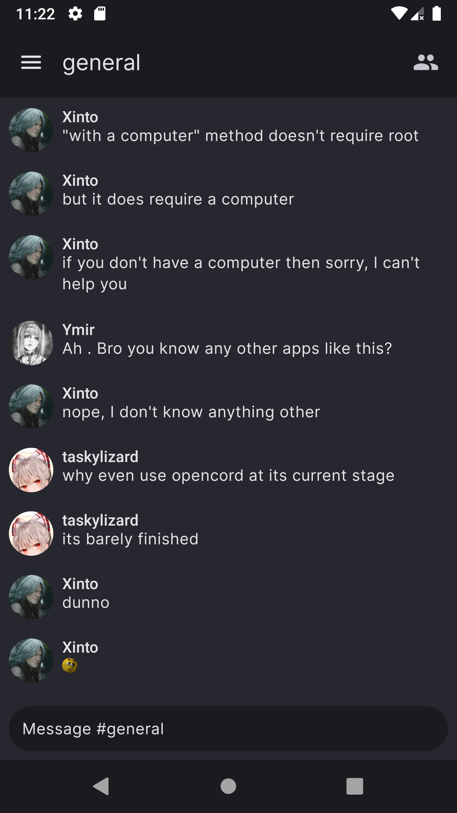
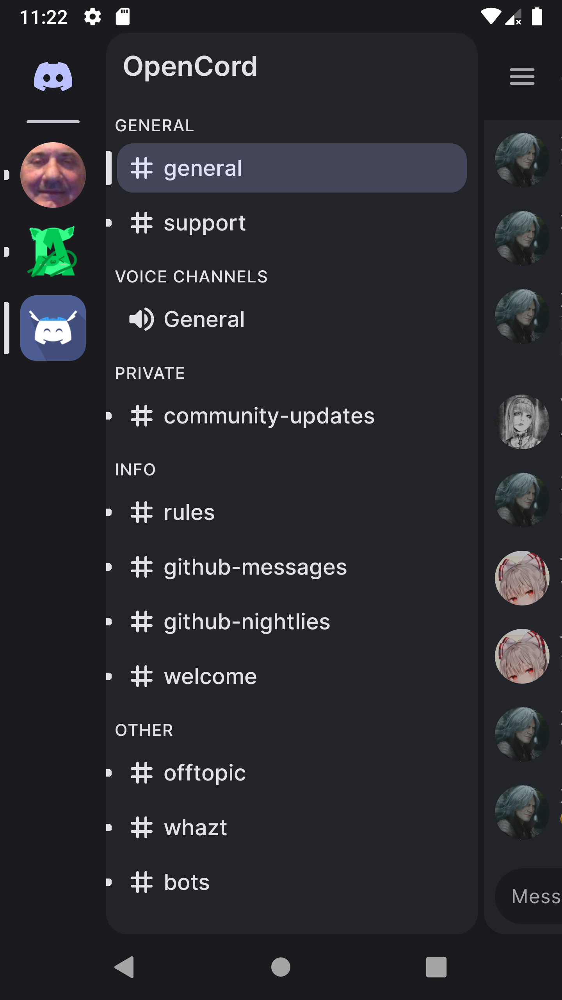

# OpenCord
[](https://discord.gg/3y6vbneMsW)
[](https://crowdin.com/project/opencord)

An open-source reimplementation of the Discord Android app.

Chat                            |  Drawer
:------------------------------:|:------------------------------:
  | 


Why does this exist?
--------------------
Current Discord app sucks as it doesn't support any type of customization (themes, plugins, layout etc...). The goal of this
project is to reimagine the Discord experience on mobile devices.

Status of OpenCord
------------------
- [ ] Full (or at least most essential) Discord feature implementation
- [ ] Theme support
- [ ] Plugin support
- [ ] Multiplatform support (Windows, macOS, Linux, Android)

#### for more information see [status](/STATUS.md)

Building
--------
### Build the project

Windows:
```shell
.\gradlew.bat build
```

Linux/macOS:
```shell
chmod +x ./gradlew && ./gradlew build
```

### Build APKs

#### Discord Version
Windows:
```shell
.\gradlew.bat assembleDiscordDebug
```

Linux/macOS:
```shell
./gradlew assembleDiscordDebug
```

#### Fosscord Version
Windows:
```shell
.\gradlew.bat assembleFosscordDebug
```

Linux/macOS:
```shell
./gradlew assembleFosscordDebug
```

FAQ
---
### Will this client support themes/plugins?
Yes, but my first priority is to implement most of the stock client's features

### Is this against Discord TOS?
Unfortunately, it is. Although I'm pretty sure Discord won't start banning anyone
for using OpenCord, considering how many mods of the stock clients already exist.
Even with that, use this client at your own risk.

### Where download???!?!?!?!?
Head over to [repository actions](https://github.com/X1nto/OpenCord/actions), click the latest run and download the `app` artifact.
After downloading, unzip it. Inside you'll find 2 files: `app-discord-debug.apk` and `app-fosscord-debug.apk`.

#### Differences between these versions
The `discord` version is considered as the standard version of the app, while the `fosscord` version is meant to be used by users familiar with [Fosscord](https://github.com/fosscord/fosscord).
Fosscord version of the app redirects to Fosscord API, CDN and Gateway instead of Discord's URLs, allowing you to fully experience OpenCord without being scared of getting banned by Discord.

### Stable version wen?
Soon™
