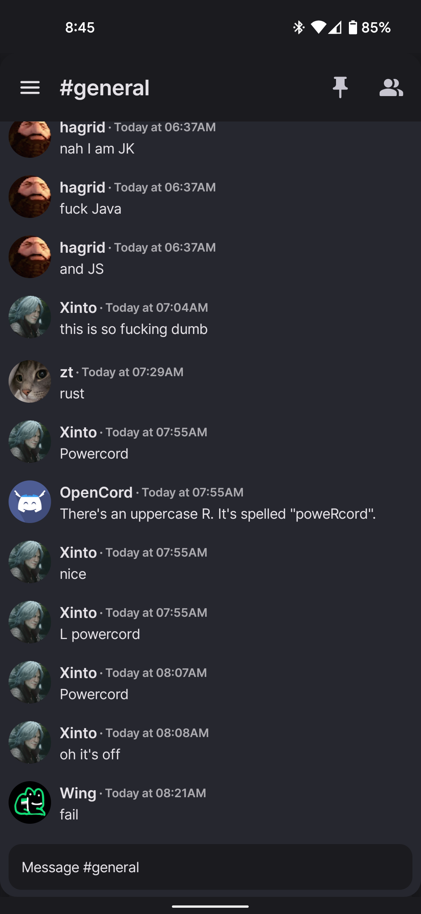

# OpenCord

[](https://discord.gg/3y6vbneMsW)
[](https://crowdin.com/project/opencord)

An open-source Material You implementation of the Discord Android app. (WIP)

|                  Chat                   |                  Drawer                   |
|:---------------------------------------:|:-----------------------------------------:|
|  |  |

## Why does this exist?

Current Discord app sucks as it doesn't support any type of customization (themes, plugins, layout
etc...). The goal of this project is to reimagine the Discord experience on mobile devices.

## Status of OpenCord

- [ ] Full (or at least most essential) Discord feature implementation
- [ ] Theme support
- [ ] Plugin support
- [ ] Multiplatform support (Windows, macOS, Linux, Android)

for more information see [STATUS.md](/STATUS.md)

## Building locally

Windows:

```batch
.\gradlew.bat app:assembleDebug
```

Linux/macOS:

```shell
./gradlew app:assembleDebug
```

Built APK will be at `app/build/outputs/apk/debug/app-debug.apk`

## FAQ

### Will this client support themes/plugins?

Yes, but the first priority is to implement most of the stock client's features

### Is this against Discord TOS?

Yes, it is. However, there has been no instances of Discord banning people for just using modified
clients. What they do automatically ban for, is API abuse or strange requests. Therefore, OpenCord
takes great caution in emulating official clients exactly, but as it is still in development, please
use an alt account for your safety.

### Where download???!?!?!?!?

Since there is no release version yet, use
this [nightly link](https://nightly.link/materiiapps/opencord/workflows/android/master/opencord.zip)
to download OpenCord. Download, extract and install the APK contained within.
