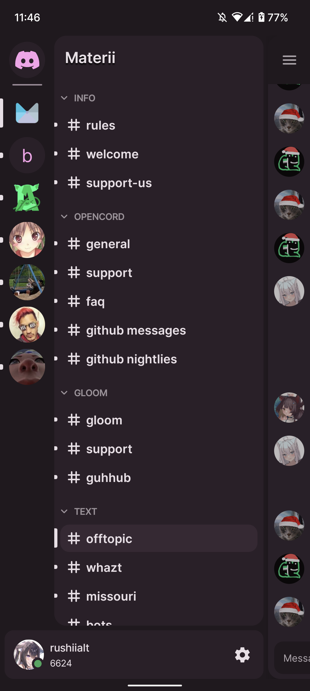

<h1 align="center">OpenCord</h1>
<p align="center">
  <a href="https://discord.gg/3y6vbneMsW">
    
  </a>
</p>
<p align="center">
  
  
  <a href="https://github.com/MateriiApps/OpenCord/blob/main/LICENSE">
    
  </a>
  <a href="https://crowdin.com/project/opencord">
    
  </a>
  <br/>
  <p align="center">
    An open-source Material You implementation of the Discord Android app. (WIP)
  </p>
</p>

## Preview

|                          Chat                           |                          Drawer                           |
|:-------------------------------------------------------:|:---------------------------------------------------------:|
|         |         |
|  |  |

## FAQ

### Will this client support "plugins" or custom features/themes?

Most likely in the future, however our first priority is to implement most of the stock client's
features. To check our current progress, see [STATUS.md](/STATUS.md). You are always welcome to fork
and add features or do it just privately!

### Is this against Discord TOS?

Yes, it is. However, there has been no instances of Discord banning people for just using modified
clients. What they do automatically ban for, is API abuse or strange requests. Therefore, OpenCord
takes great caution in emulating official clients exactly, but as it is still in development, please
***use an alt account for your safety.***

### Where download???!?!?!?!?

Since there is no release version yet, use
this [nightly link](https://nightly.link/materiiapps/opencord/workflows/android/master/opencord.zip)
to download OpenCord. Download, extract and install the APK contained within. If you are
reinstalling or updating, you have to uninstall the old version first!

## Building locally

Windows:

```batch
.\gradlew.bat app:assembleDebug
```

Linux/macOS:

```shell
./gradlew app:assembleDebug
```

Built APK will be at `app/build/outputs/apk/debug/app-debug.apk`
