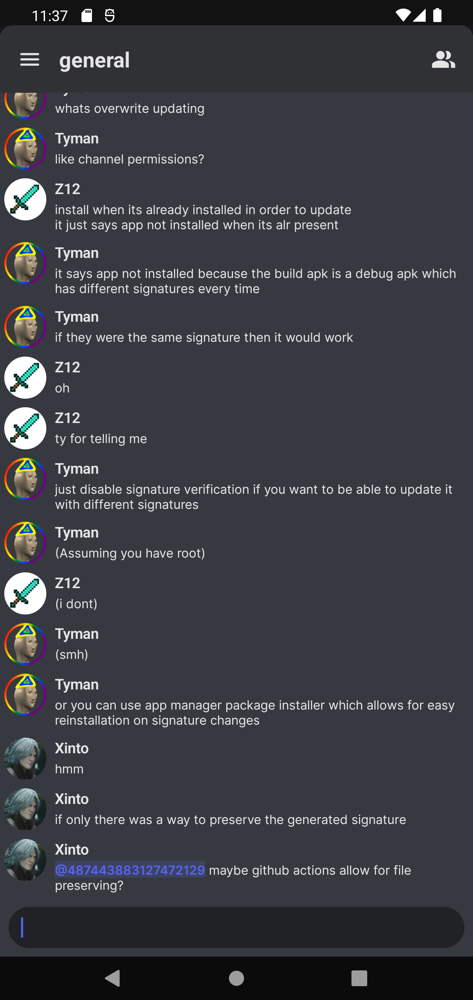
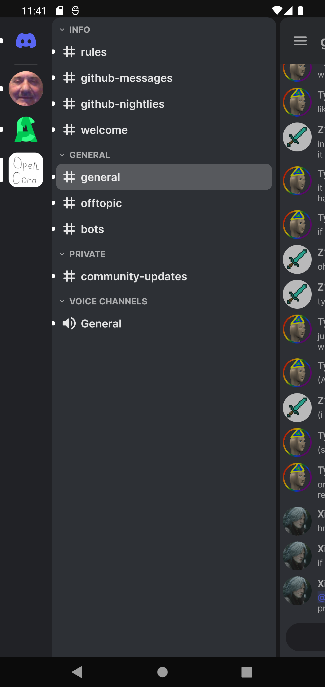

# OpenCord

An open-source reimplementation of the Discord Android app.

Chat                            |  Drawer
:------------------------------:|:------------------------------:
  | 

Why does this exist?
-------
Current discord app sucks as it looks ugly and doesn't support themes. The goal of this
project is to reimagine the Discord experience on mobile devices.

Status of OpenCord
-------
- [ ] Full (or at least most essential) Discord feature implementation
- [ ] Theme support
- [ ] Plugin support
- [ ] Multiplatform support (Windows, macOS, Linux, Android)

FAQ
-------
### Will this client support themes/plugins?
Yes, but my first priority is to implement most of the stock client's features

### Is this against Discord TOS?
Unfortunately, it is. Although I'm pretty sure Discord won't start banning anyone
for using OpenCord, considering how many mods of the stock clients already exist.
Even with that, use this client at your own risk.

### Working version wen?
Soon™
